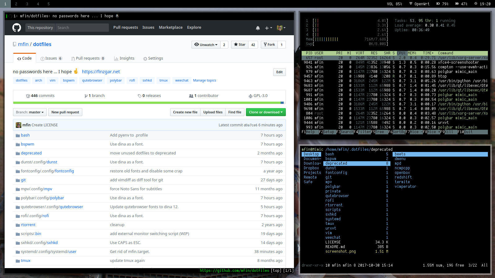

dotfiles
========

Here be my dotfiles. My flavor of choice is Arch, but everything should work on other distros AFAIK.

management
----------
Dotfiles are managed with [GNU Stow](https://www.gnu.org/software/stow/).

```
git clone https://github.com/mfin/dotfiles ~/.dotfiles
cd ~/.dotfiles
stow <folder name>
```

dependencies from AUR
---------------------
```
rxvt-unicode-256xresources, dmenu2, lemonbar-xft-git, stlarch_font
```

screenshot
----------
Note: This screenshot is out-of-date; currently I'm running Arch Linux with Mate desktop environment (I got tired of tiling).


