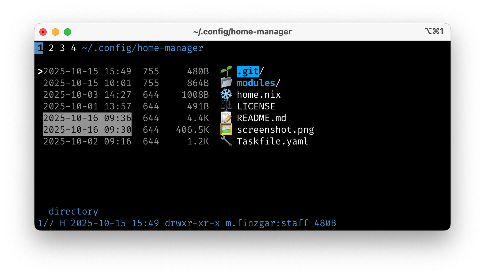

dotfiles
========

Here be my dotfiles. My flavor of choice is Arch, but everything should work on other distros AFAIK.

management
----------
Dotfiles are managed with [GNU Stow](https://www.gnu.org/software/stow/).

```
git clone https://github.com/mfin/dotfiles ~/.dotfiles
cd ~/.dotfiles
stow <folder name>
```

Still usable but unused dotfiles are stored in the deprecated directory.

screenshot
----------


